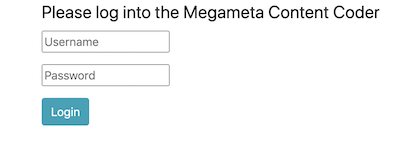

# Megameta Content Analysis Coder

### A web-based application for doing content analysis coding on text, image and video stimuli

Copyright (c) 2020 Communication Neuroscience Lab

----------

## Overview

* Lightweight user accounts and  authentication.

* User-based coding assignments and tracking

* Configurable content survey and items using [survey.js](https://surveyjs.io/Overview/Library)

* Admin functions to track coding and export data

## Setup & Installation

* The coder is a Python based web app using Flask, Mongodb and Bootstrap

* __N.B.__ We are currently refactoring the code and installation to create a Docker container version to ease installation and running issues.

* With the requirements installed, it should run on an *nix based system with Python 3.7+ installed. It should also be possible to set it up on a Windows-based system.

	* [Linux-based installation instructions](doc/install.md)

